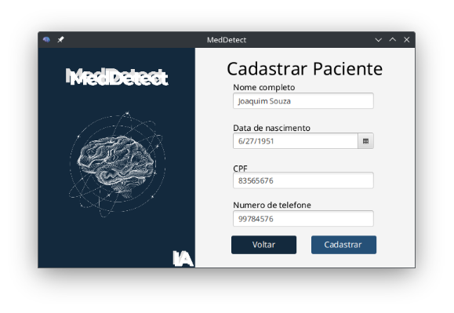
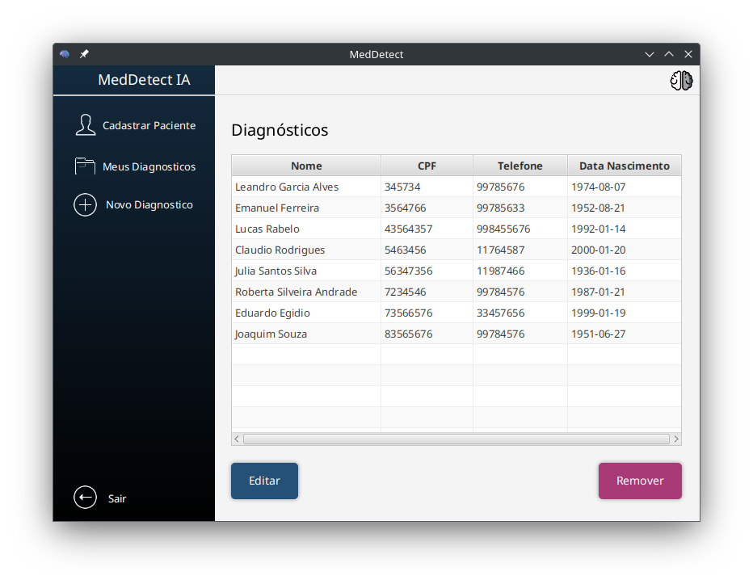
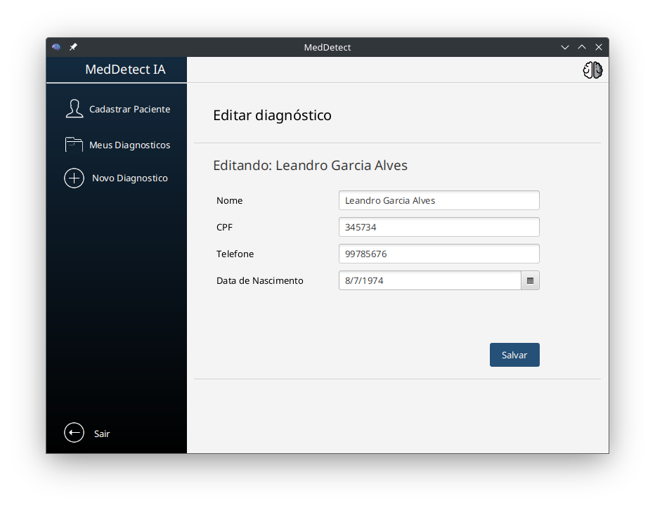
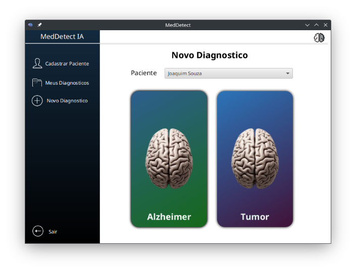
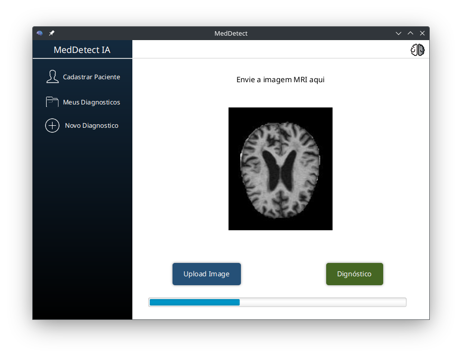
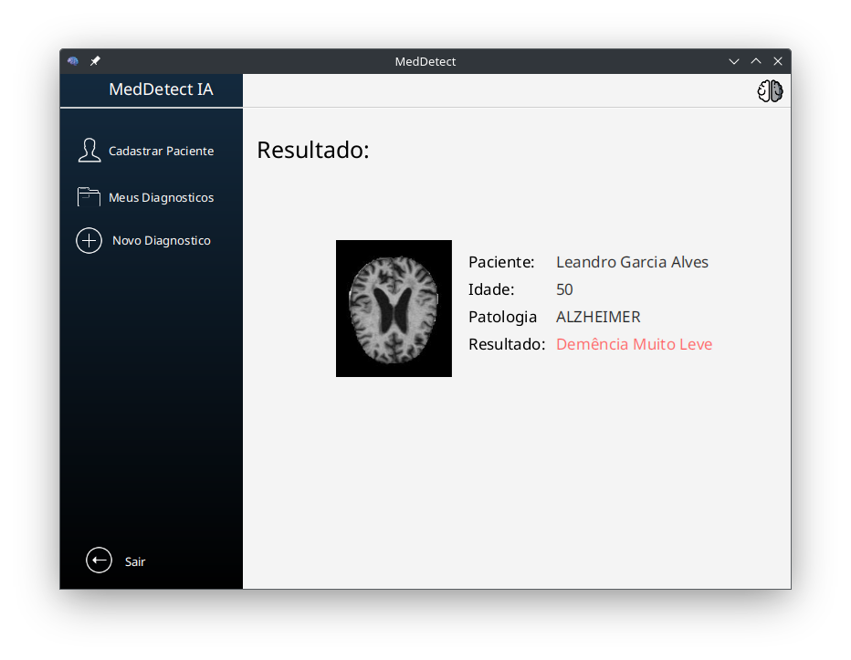

# MedDetect

## Overview
MedDetect is a Java project utilizing the Deep Java Library (DJL) for artificial intelligence and JavaFX for the graphical user interface. This program predicts classifications of Alzheimer's disease and brain tumors based on MRI images. 

This project is part of a scholarly initiative at the Federal Institute of Education, Science and Technology of São Paulo - IFSP Campinas Campus. It was developed by 2nd year high school students under my supervision and guidance. The project serves as an educational tool, showcasing fundamental concepts of machine learning and object-oriented programming.

**Disclaimer:** This is an amateur project, not intended for professional or clinical use.

## Classifications
### Alzheimer Predictions:
- Leve Demência
- Demência Moderada
- Sem Demência
- Demência Muito Leve

### Tumor Predictions:
- Tumor Pituitário
- Tumor Meningioma
- Sem Tumor
- Tumor Glioma

## Features
- Detection of brain tumors and Alzheimer's disease stages from MRI samples.
- Educational demonstration of artificial intelligence applied to healthcare.
- User-friendly JavaFX interface designed for students and enthusiasts.

## Usage
1. Register the medical professional.
2. Register the patient in the "Cadastrar Paciente" section.
3. Prepare MRI images in a compatible format (e.g., PNG).
4. Upload the image through the application interface.
5. Select the desired analysis type: Tumor or Alzheimer.
6. View the prediction results, which indicate the likelihood of each classification.
7. Access the diagnosis in the "Meus Diagnósticos" section.

## Screenshots
Below are some example screenshots of the program:

- **Login and Dashboard**  
  

- **Diagnostics Overview**  
  

- **Edit Information**  
  

- **Select Diagnosis Type**  
  

- **Prediction Results**  
  

- **Generated Report**  
  

## License
This project is open for educational and non-commercial use. Contributions and feedback are welcome.
